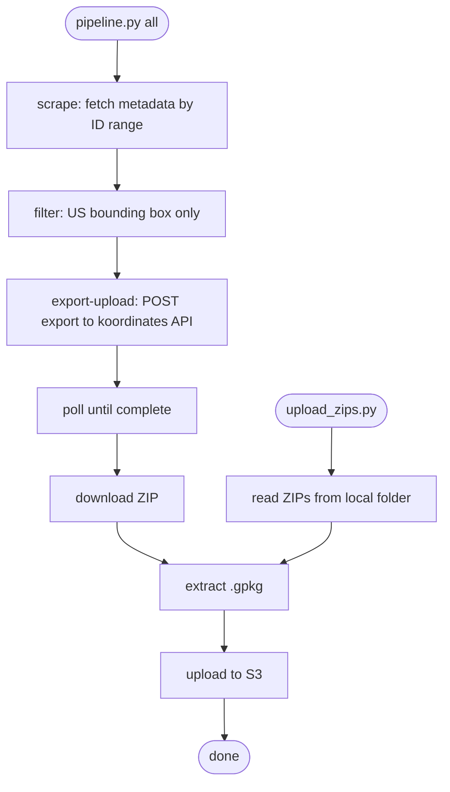

# Implementation Plan: koordinates-scraper

## Overview

**Spec**: `specs/active/koordinates-scraper/spec.md`

**Summary**: Create `scrapers/koordinates_scraper/` — a clean, company-standard rewrite of the koordinates pipeline with no hardcoded credentials or paths.

**Estimated Checkpoints**: 3

---

## Context

### Codebase Research

| File | Purpose | Pattern to Follow |
|------|---------|-------------------|
| `tools/koordinates/koordinates_pipeline.py` | Source of truth for scrape + export + upload logic | Extract, clean, remove hardcoded values |
| `tools/koordinates/koordinates_unzip_save_to_s3.py` | Source for upload_zips logic | Extract, clean, remove hardcoded paths |
| `tools/polygon_query/capability.yaml` | Gold-standard capability.yaml example | Copy structure exactly |
| `tools/polygon_query/requirements.txt` | Minimal clean deps pattern | Follow same style |
| `templates/capability_template.yaml` | Required starting point for capability.yaml | Use as base |

### Existing Patterns

Credential loading pattern (from `shared/db.py` — adapt for this tool):
```python
from dotenv import load_dotenv
load_dotenv()
cookie = os.getenv("KOORDINATES_COOKIE")
if not cookie:
    print("ERROR: KOORDINATES_COOKIE not set. Copy .env.example to .env and fill in credentials.")
    sys.exit(1)
```

CLI pattern (from `koordinates_pipeline.py`):
```python
p = argparse.ArgumentParser(...)
sub = p.add_subparsers(dest="cmd", required=True)
sp = sub.add_parser("scrape", ...)
sp.add_argument("--start-id", type=int, required=True)
```

### Gotchas

| Gotcha | Impact | How to Handle |
|--------|--------|---------------|
| Old pipeline has cookie hardcoded as argparse default | Credential leak | Remove default entirely — env var or explicit arg only |
| `aws_utils_4ma` requires Nexus creds at install time | CI will fail without NEXUS_* env vars | Document in README; reference `4ma-requirements.txt` |
| `asyncio.to_thread` requires Python 3.9+ | Silent failure on older Python | Note in README / requirements |
| Cookie-based auth on koordinates expires | Tool will fail silently | Document rotation steps in README |

---

## Implementation

### File Changes Overview

```
scrapers/                                    # CREATE: new top-level folder
  koordinates_scraper/
    capability.yaml                          # CREATE
    README.md                                # CREATE
    requirements.txt                         # CREATE
    .env.example                             # CREATE
    pipeline.py                              # CREATE: unified CLI
    upload_zips.py                           # CREATE: standalone S3 uploader
```

### Flow Diagram



---

## Checkpoints

### Checkpoint 1: Scaffold — config files

**Goal**: Create the folder structure and all non-Python files so the tool is
discoverable and documented before any code is written.

**Tasks**:

1. **CREATE** `scrapers/koordinates_scraper/capability.yaml`
   - Use `templates/capability_template.yaml` as base
   - Match style of `tools/polygon_query/capability.yaml`
   - Status: `experimental`

2. **CREATE** `scrapers/koordinates_scraper/.env.example`
   ```
   # Koordinates session credentials (cookie-based auth)
   # Refresh these when your session expires on koordinates.com
   KOORDINATES_COOKIE=
   KOORDINATES_CSRF=

   # 4m Nexus (required to install 4ma internal packages)
   NEXUS_USERNAME=
   NEXUS_PASSWORD=
   ```

3. **CREATE** `scrapers/koordinates_scraper/requirements.txt`
   ```
   pandas>=1.5
   requests>=2.28
   python-dotenv>=0.20
   ```
   Note: `aws_utils_4ma` comes from `4ma-requirements.txt` (org-level), not here.

4. **CREATE** `scrapers/koordinates_scraper/README.md`
   - Setup section (cp .env.example, pip install)
   - Usage examples for all three subcommands + upload_zips.py
   - Note on cookie rotation

**Validation**:
```bash
ls scrapers/koordinates_scraper/
# should show: capability.yaml README.md requirements.txt .env.example
grep -r "Cookie\|sessionid\|csrftoken" scrapers/koordinates_scraper/ || echo "clean"
```

**Commit Message**:
```
koordinates-scraper: add scaffold (capability.yaml, README, deps, .env.example)
```

---

### Checkpoint 2: pipeline.py

**Goal**: Clean, credential-safe unified CLI covering scrape / export-upload / all.

**Depends on**: Checkpoint 1

**Tasks**:

1. **CREATE** `scrapers/koordinates_scraper/pipeline.py`

   Structure:
   ```
   load_dotenv()
   validate_credentials()   ← exit with clear message if missing

   scrape_layer_metadata(layer_id) → dict | None
   scrape_layers(start_id, end_id, threads, log_json, out_csv) → DataFrame

   extent_within_us(extent) → bool
   wrap_extent_for_export(extent) → dict | None
   request_export_and_download_zip(layer_id, extent, headers) → bytes | None
   extract_first_gpkg(zip_bytes) → (name, BytesIO) | None
   upload_gpkg_bytes(s3_bucket, s3_prefix, layer_id, title, ...) → dict   [async]
   export_and_upload_from_df(df, headers, ...) → DataFrame                [async]

   build_arg_parser() → ArgumentParser
   main()
   ```

   Key rules:
   - `load_dotenv()` at top of `main()` — no credentials in defaults or module scope
   - All paths default to CWD (e.g. `Path("koordinates_scraper_log.json")`)
   - No hardcoded cookie, CSRF, bucket, or prefix in source — all via args with documented defaults only for non-sensitive values (bucket, prefix)

2. **Credential guard** (first thing in main, before any work):
   ```python
   def _require_env(key: str) -> str:
       val = os.getenv(key, "").strip()
       if not val:
           print(f"ERROR: {key} is not set. Copy .env.example to .env and fill in credentials.")
           sys.exit(1)
       return val
   ```
   Only called for export-upload and all subcommands (scrape doesn't need auth).

**Validation**:
```bash
grep -n "Cookie\|sessionid\|csrftoken\|hardcoded" scrapers/koordinates_scraper/pipeline.py || echo "clean"
python scrapers/koordinates_scraper/pipeline.py scrape --help
python scrapers/koordinates_scraper/pipeline.py export-upload --help
```

**Review Focus**:
- Zero credentials in source
- All paths relative or CLI-configurable
- Clear error messages for missing credentials

**Commit Message**:
```
koordinates-scraper: add pipeline.py (scrape / export-upload / all subcommands)
```

---

### Checkpoint 3: upload_zips.py

**Goal**: Standalone script to upload pre-downloaded local ZIPs to S3.

**Depends on**: Checkpoint 1

**Tasks**:

1. **CREATE** `scrapers/koordinates_scraper/upload_zips.py`

   Structure:
   ```
   load_dotenv()

   load_uploaded_ids(log_path) → set[str]
   append_uploaded_id(log_path, layer_id)
   extract_first_gpkg(zip_bytes) → (name, BytesIO) | None
   upload_gpkg(s3_bucket, s3_prefix, layer_id, name, gpkg_bytes) → dict  [async]
   process_zip(zip_path, sem, uploaded_before, s3_bucket, s3_prefix) → dict | None  [async]
   upload_all(folder, s3_bucket, s3_prefix, concurrency, log_path) → DataFrame  [async]

   build_arg_parser() → ArgumentParser
   main()
   ```

   CLI:
   ```
   python upload_zips.py --zip-folder ./downloads/ [--s3-bucket ...] [--s3-prefix ...]
   ```

   No auth needed (S3 credentials come from AWS env, not koordinates).

**Validation**:
```bash
grep -n "hardcoded\|/Users/" scrapers/koordinates_scraper/upload_zips.py || echo "clean"
python scrapers/koordinates_scraper/upload_zips.py --help
```

**Review Focus**:
- No hardcoded paths
- Skips already-uploaded layers (idempotent)
- Clean output: progress per ZIP, summary count at end

**Commit Message**:
```
koordinates-scraper: add upload_zips.py (local ZIP → S3 uploader)
```

---

## Decisions Made

| Decision | Options Considered | Chosen | Rationale |
|----------|-------------------|--------|-----------|
| New `scrapers/` top-level folder | Put under `tools/` | `scrapers/` | Scrapers are data-ingestion pipelines, not query/analysis tools — distinct enough to warrant their own folder |
| `upload_zips.py` as separate script vs pipeline subcommand | Subcommand | Separate script | Different entry point (local disk vs API export); adding it as a subcommand would require making `--zip-folder` a required arg for one path and ignored for all others |
| Credential loading | argparse defaults, module-level constants | `load_dotenv()` + `os.getenv` + explicit guard | Consistent with `.env.example` pattern; no risk of credentials appearing in `--help` output or stack traces |
| S3 upload library | boto3 directly | `aws_utils_4ma.S3StorageStrategy` | Already used in old code, consistent with 4m internal infra |

---

## Risks

| Risk | Likelihood | Impact | Mitigation |
|------|------------|--------|------------|
| Cookie auth expires mid-run | High | Medium | Log warning + continue; document rotation in README |
| Nexus unavailable at install time | Low | High | Document NEXUS_* env vars in README and .env.example |
| koordinates API rate limits during bulk scrape | Medium | Low | Random shuffle + configurable thread count |

---

## Anti-Patterns to Avoid

- No `HEADERS = {"Cookie": "..."}` at module scope — always build headers inside a function after env load
- No `argparse` defaults that contain real tokens or session values
- No `print(os.environ)` or debug prints that could expose credentials
- Do not duplicate `extract_first_gpkg` or S3 upload logic across pipeline.py and upload_zips.py — if it grows, move to a shared helper inside the tool folder

---

## Checklist Before Implementation

- [x] All checkpoints have clear validation commands
- [x] Each checkpoint is independently reviewable
- [x] Patterns referenced exist in codebase
- [x] Gotchas addressed
- [x] Open questions resolved
- [ ] User has approved this plan

---

## Checklist Before Completion

- [ ] All checkpoints approved by human
- [ ] VERSION file bumped
- [ ] Completion summary created in `specs/completed/`
- [ ] Active spec directory removed
- [ ] Learnings documented
